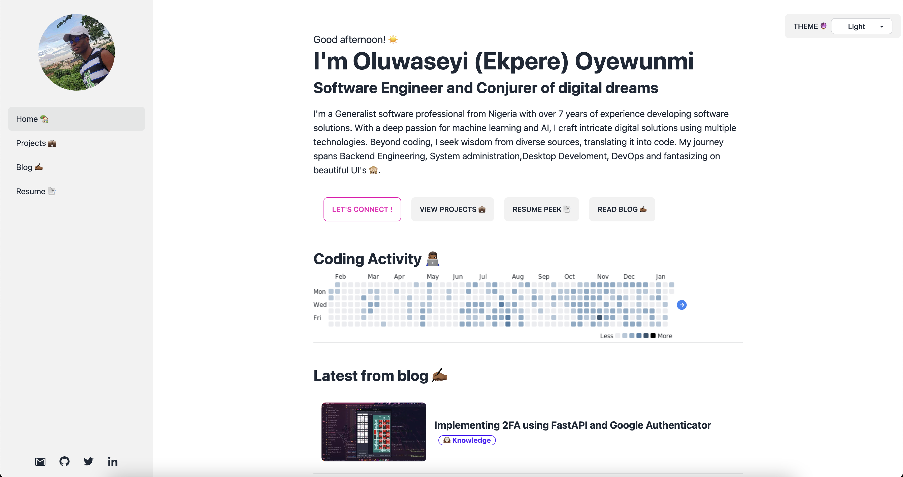

# Personal Portfolio Website Template



This is my personal portfolio code which started off with the [Astrofy](https://astro.build/themes/details/astrofy-personal-porfolio-website-template/) template as the baseground.

## Demo

View live at [PortFolio Page](https://seyidev.tech/)

## Installation

Run the following command in your terminal

```bash
npm install
```

Once the packages are installed you are ready to run astro. Astro comes with a built-in development server that has everything you need for project development. The astro dev command will start the local development server so that you can see your new website in action for the very first time.

```bash
npm run dev
```

## Tech Stack

- [Astro](https://astro.build)
- [tailwindcss](https://tailwindcss.com/)
- [DaisyUI](https://daisyui.com/)
- [FlowBite](https://flowbite.com/)
- [Swup](https://swup.js.org/)
